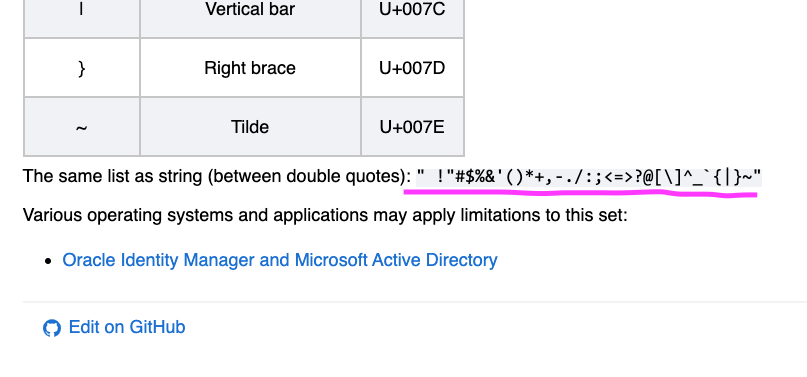

# Password Generator

## Description

For this week's challenge, I'd like to explore some basic Javascript. In the process, I'm going to build myself a simple password generator.

| **Scenario**                                                                                                                                                                                                                                                                                                                 |
| :--------------------------------------------------------------------------------------------------------------------------------------------------------------------------------------------------------------------------------------------------------------------------------------------------------------------------- |
| _The password generator will ask the user to specify the length their desired password. They also should be able to confirm what types of characters to include (lowercase letters, uppercase letters, numeric, or special). Based on that user input, the tool will generate a random sequence and present it on the page._ |

A project like this should give me a chance to play with some basic JS methods. I'm also interested in exploring the Object data type.

Away we go!

---

## My Approach

First things first, I needed to create some "character libraries" from which to randomly pull characters. It makes sense to store these as arrays.

Because I want the user to be able to include or reject character types, I decided to hold them in separate arrays at first, then combine them based on the user's input.

### Building the Arrays

Rather than type out the arrays by hand, I decided to include each "type" as a single string. Then I used the `split()` method to generate the arrays.

To take the "Special Characters" array as an example, I simply copied the string of special characters from [owasp.org](https://owasp.org/www-community/password-special-characters).



Then I pasted that string into a variable and ran a `split()` to generate the array.

```javascript
var specialCharacterString = "!\"#$%&'()*+,-./:;<=>?@[\\]^_`{|}~";

var specialCharacters = specialCharacterString.split("");
```

### Collecting User Input

I chose to store the user input as an object called `criteria`, the properties of which were the specifications of the to-be-generated password, e.g. `numChars` stores an integer that specifies the number of characters, `lowercase` stores a boolean that dicates whether or not to include lowercase letters, etc.

> In retrospect, I think I should have named this object something a little more clear and descriptive, like `userInput`. In general, "naming variables something clear and concise that you won't regret and want to change later" is a real area of growth for me.

Because I was interested in exploring objects as a Javascript concept, I chose to include the function for collecting the user input as a method on that same object. The method uses a combination of `prompt()` and `confirm()` to assign values to the `criteria` object's properties.

> Specifically, I was interested in getting more familiar with the `this` keyword, and writing the method was a nice way to do that.

As the user confirms each character category, that array gets merged into the `criteria.character` property. If, at the end of the process no categories have been included, the user is alerted and told to start again.

### Generating the Password

Once I got the user input functionality sorted out, it was pretty straightforward to generate the password string. I just ran a `for` loop to build a string of the user-specified length, using the `Math.floor` and `Math.random` methods to grab a random entry in the character library each time.

```javascript
for (let i = 0; i < criteria.numChars; i++) {
  passwordString +=
    criteria.characters[Math.floor(Math.random() * criteria.characters.length)];
}
```

## Credits

For this project, my only real outside reference text was the Javascript section over on [MDN Web Docs](https://developer.mozilla.org/en-US/docs/Web/JavaScript). Although, in all likelihood, I probably also looked at [W3Schools](https://www.w3schools.com/jsref/default.asp).

## Learnings

This was a fun way to play around with some basic Javascript, and I do think I got a lot more comfortable with the `this` keyword (and objects in general).

I strongly dislike the `prompt()` and `confirm()` methods as a means of interacting with users. (I don't think this is a hot take, since I almost never see these methods used on other sites.) I would much rather fill out a form to specify my preferences.

After looking into how to make that form a reality, it seems pretty straightforward (use querySelectors to look at elements, etc.), but I decided that fell outside the scope of this particular exercise. I may come back later and update this to make it more fun to use.

## License

MIT License

Copyright (c) 2023 Austin Zumbro

Permission is hereby granted, free of charge, to any person obtaining a copy
of this software and associated documentation files (the "Software"), to deal
in the Software without restriction, including without limitation the rights
to use, copy, modify, merge, publish, distribute, sublicense, and/or sell
copies of the Software, and to permit persons to whom the Software is
furnished to do so, subject to the following conditions:

The above copyright notice and this permission notice shall be included in all
copies or substantial portions of the Software.

THE SOFTWARE IS PROVIDED "AS IS", WITHOUT WARRANTY OF ANY KIND, EXPRESS OR
IMPLIED, INCLUDING BUT NOT LIMITED TO THE WARRANTIES OF MERCHANTABILITY,
FITNESS FOR A PARTICULAR PURPOSE AND NONINFRINGEMENT. IN NO EVENT SHALL THE
AUTHORS OR COPYRIGHT HOLDERS BE LIABLE FOR ANY CLAIM, DAMAGES OR OTHER
LIABILITY, WHETHER IN AN ACTION OF CONTRACT, TORT OR OTHERWISE, ARISING FROM,
OUT OF OR IN CONNECTION WITH THE SOFTWARE OR THE USE OR OTHER DEALINGS IN THE
SOFTWARE.
